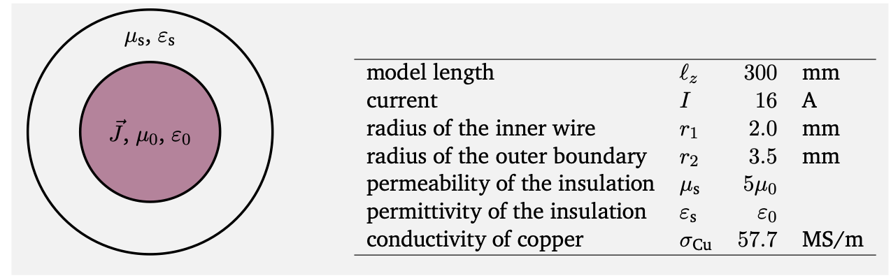
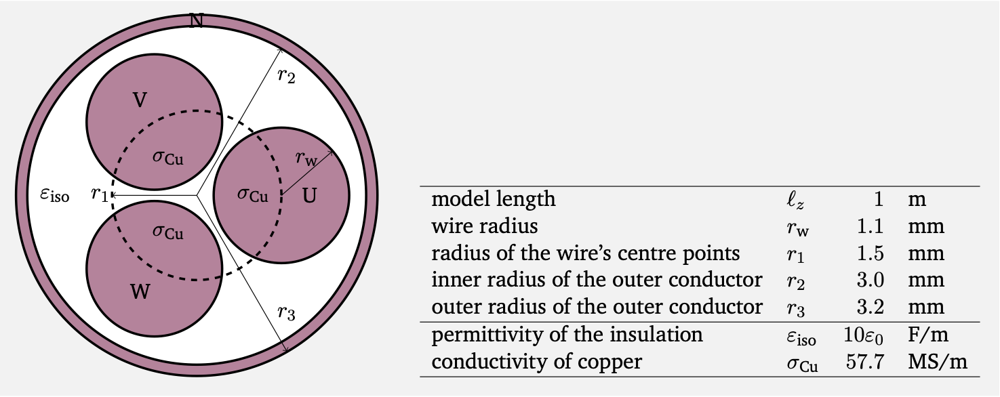

# Finite Element Modeling and Simulation of Multiconductor Transmission-Line Problems

This repository analyzes multiconductor transmission line problems and provides a simulation tool to solve such problems through Finite Element Modeling. For further theoretical insight into multiconductor transmission lines, refer to the following paper:

- [Nonuniqueness of modal transformations for multiconductor transmission line problems](https://onlinelibrary.wiley.com/doi/10.1002/etep.2342)

  

## Overview

The repository is divided in seperate modules: Transmission Line Simulation, Multitransmission Line Simulation and Machine Slot Simulation.

### Transmission Line Simulation
#### Problem Setting
A model of a coaxial cable with axial length $l_z$ is considered. A current $I$ is homogeneously distributed along the cross section of a cylindrical copper wire with conductivity $\sigma_{Cu}$, radius $r_1$, aligned with the $z$-direction. The wire is enclosed within a cylindrical, non-conducting insulation shell with inner radius $r_1$, outer radius $r_2$ and with permeability μs and permittivity $\epsilon_s = \epsilon_0$, where $\mu_0$ and $\epsilon_0$ are the permeability and permittivity of vacuum. The outer surface of the insulation shell is considered as a perfect electric conductor.

  

In this module we solve the described magnetostatic problem in **Python**. We start by solving the problem analytical and plotting the respective fields. Afterwards we use
[Gmsh](https://gmsh.info), an open source FE mesh generator, and define with it the wire problem’s geometry and specify regions of different materials. Then, we define boundary conditions and solve the magnetic field problem on this meshed wire with FE modeling. Subsequently, we do some postprocesing, i.e., compare the numerical solutione with the analytical one, check convergence,..., discretization error. Finally, we use [Pyrit](https://www.temf.tu-darmstadt.de/emft/forschung_emft/software_1/software.en.jsp), a FE solver for coupled electro- and magneto-quasistatic and thermal problems written in Python, to solve this problem and compare its solution again with our previous results.

### Multitransmission Line Simulation
#### Problem Setting

  

In this module we implement an own simulation tool for multiconductor transmission-line models (MTLMs). Similar to the last problem, we mesh the geometry and specify the different materials with [Gmsh](https://gmsh.info). Then we solve the electro- and magnetostatic, and the electro- and magnetoquasistatic with and without excitation in the frequency-domain. Specifially, we use a modal decomposotion and the low-frequency approximation to tractably numerically solve this problem.
### Machine Slot Simulation
#### Problem Setting

  

In this module we implement an own simulation tool for МТLMs. Similar to the last problem, we mesh the geometry and specify the different materials with [Gmsh](https://gmsh.info). Then we solve the electro- and magnetostatic on a machine slot with 36 single wires.

  

